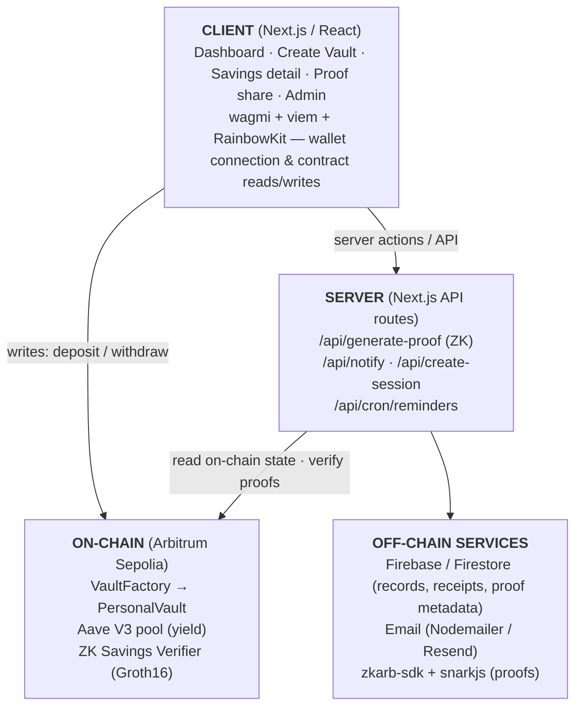

# Architecture

This document describes how Savique is put together: the on-chain contracts, the
off-chain services, the data flow for the core user journeys, and the project layout.

For the product overview see **[Introduction.md](./Introduction.md)**; for the
zero-knowledge privacy design see **[privacy.md](./privacy.md)**.

---

## 1. High-Level Overview

Savique is a full-stack dApp composed of three cooperating tiers:



- The **client** handles wallet connection and direct user-signed transactions
  (creating vaults, depositing, withdrawing).
- The **server** (Next.js API routes, Node runtime) handles operations that must not
  trust the client: zero-knowledge proof generation, notification dispatch, and
  scheduled reminders.
- **On-chain** contracts are the source of truth for balances and yield; **Firebase**
  stores supporting metadata (vault records, receipts, and privacy-preserving proof
  documents).

---

## 2. Smart Contracts

All contracts are Solidity `^0.8.20`, use OpenZeppelin libraries, and are deployed on
**Arbitrum Sepolia**.

### 2.1 `VaultFactory.sol`

The factory is the single entry point for creating savings vaults.

- **Minimal-proxy clones.** Each user vault is deployed via OpenZeppelin
  `Clones.clone(implementation)` (EIP-1167). A single `PersonalVault` implementation is
  deployed once; every user vault is a cheap proxy pointing at it, which keeps deployment
  gas low.
- **Registry.** Tracks `vaultById`, `isVault`, per-user `userVaults`, and a global
  `allVaults` list, and emits `VaultCreated(user, vault, vaultId, purpose)`.
- **Optional initial deposit.** On creation, an initial USDC deposit can be pulled from the
  user and immediately supplied into the vault via `depositFromFactory`.
- **Ownable admin hooks.** The factory owner can trigger the beneficiary recovery path
  (`triggerBeneficiaryClaim`) and execute auto-deposits.

Key entry point:

```solidity
function createPersonalVault(
    string  _purpose,          // e.g. "Property Deposit"
    uint256 _unlockTimestamp,  // when the vault matures
    uint256 _penaltyBps,       // early-exit penalty in basis points
    uint256 _initialDeposit,   // optional first deposit (USDC base units)
    address _beneficiary       // emergency recovery address
) external returns (address vault);
```

### 2.2 `PersonalVault.sol`

A single user's savings vault. Kept deliberately small (no inheritance beyond the
essentials) so the clone bytecode stays minimal.

- **Initializable, not constructed.** Because vaults are clones, state is set through
  `initialize(...)` (guarded by OpenZeppelin `Initializable`), not a constructor. The base
  implementation disables initializers in its own constructor.
- **Aave V3 yield.** On `initialize`, the vault reads the reserve's `aTokenAddress` and
  grants Aave a max approval. Every deposit calls `aavePool.supply(...)`, so idle capital
  immediately earns yield. `totalAssets()` returns the vault's aToken balance — the live
  principal **plus** accrued yield.
- **Accounting.** `totalPrincipal` tracks deposited capital. Realized **profit** is computed
  by subtraction (`totalAssets − totalPrincipal`) rather than a simulated APY.
- **Withdrawal logic** (`withdraw()`), gated by `unlockTimestamp`:
  - **At/after maturity:** profit is split — a `SUCCESS_FEE_BPS = 2000` (20%) success fee on
    the *profit only* goes to the treasury; the remainder goes to the user.
  - **Before maturity (early exit):** a `penaltyBps` penalty on the withdrawn amount goes to
    the treasury; the rest is returned to the user.
- **Reentrancy-safe.** State-changing external calls use OpenZeppelin `ReentrancyGuard` and
  `SafeERC20`.
- **Emergency beneficiary.** `claimByBeneficiary()` (callable only via the factory) lets a
  designated beneficiary recover funds through the admin-triggered recovery path, governed by
  a `GRACE_PERIOD` of 365 days.

Emitted events (`Deposited`, `Withdrawn`, `EarlyWithdrawal`, `FullWithdrawal`,
`BeneficiaryClaimed`) are the raw material for the on-chain receipt/audit trail.

### 2.3 Supporting contracts

- **`interfaces/IAavePool.sol`** — the minimal Aave V3 pool interface (`supply`, `withdraw`,
  `getReserveData`) the vault depends on.
- **`TestToken.sol`** — a mintable ERC-20 used as test USDC on Sepolia.
- **`savings_verifier/verifier.sol`** — the Groth16 verifier (see [privacy.md](./privacy.md)).

### 2.4 Tooling

Contracts are built, tested, and deployed with **Hardhat** (`hardhat.config.ts`), the
Hardhat Toolbox, TypeChain typings, gas reporter, and coverage. Deployment scripts live in
`scripts/` (`deploy_factory_v2.ts`, `set_base_uri.ts`).

---

## 3. Frontend (Next.js App Router)

Located under `app/`, using the App Router with a mix of server and client components.

| Route                              | Purpose                                                    |
| ---------------------------------- | ---------------------------------------------------------- |
| `app/page.tsx`                     | Marketing / landing page                                   |
| `app/dashboard/page.tsx`           | User dashboard — vaults, TVL, goals                        |
| `app/dashboard/create/`            | Create-vault flow (incl. `ChainrailsModal`)                |
| `app/dashboard/savings/[address]/` | Single-vault detail; entry point for "Share Proof"         |
| `app/dashboard/history/`           | Receipt / audit-trail dashboard                            |
| `app/dashboard/analysis/`          | Financial intelligence & TVL charts                        |
| `app/dashboard/leaderboard/`       | Savings leaderboard                                        |
| `app/proof/[proofId]/`             | Public, privacy-preserving proof view (no wallet shown)    |
| `app/verify/[id]/`                 | Receipt verification page                                  |
| `app/admin/*`                      | Admin console (active/completed/broken vaults, users, etc.)|

- **Providers** (`app/providers.tsx`) wire up wagmi, viem, RainbowKit, and React Query.
- **State & chain access** uses `wagmi` hooks (`useReadContract`, etc.) with the ABIs and
  addresses centralized in `lib/contracts.ts`.
- **UI** is built with Tailwind CSS v4, Framer Motion, Recharts, lucide-react icons, and a
  small `components/ui/` primitive set. Feature components include `ShareProofModal`,
  `ProofSelectionModal`, `VaultTopUpModal`, `VaultBreakModal`, and `NotificationBell`.

---

## 4. Server / API Routes

API routes run on the **Node.js runtime** (not edge) where they need filesystem access or
to keep secrets server-side.

| Route                         | Responsibility                                                            |
| ----------------------------- | ------------------------------------------------------------------------- |
| `app/api/generate-proof`      | Reads real on-chain savings, generates + verifies a ZK proof, stores metadata |
| `app/api/notify`              | Sends transactional / security / maturity emails                          |
| `app/api/create-session`      | Session bootstrap (relative URL so it works on any hosted domain)         |
| `app/api/cron/reminders`      | Scheduled maturity & reminder notifications                               |

The **`/api/generate-proof`** route is the security-critical one: it never trusts the client
for the private inputs. It reads the savings balance from `PersonalVault.totalAssets()` and
the lock-start time from the server-side vault record, so a user cannot lie about how much
they saved or how long they have been saving. Full detail is in [privacy.md](./privacy.md).

---

## 5. Shared Library Layer (`lib/`)

| Module                  | Role                                                                  |
| ----------------------- | --------------------------------------------------------------------- |
| `contracts.ts`          | Contract addresses + ABIs (`VAULT_ABI`, `VAULT_FACTORY_ABI`, `ERC20_ABI`, `AAVE_POOL_ABI`) |
| `zkProof.ts`            | Server-side wrapper around the `zkarb-sdk` (`generateAndVerifyProof`)  |
| `proofStore.ts`         | Firestore read/write for **privacy-preserving** proof metadata        |
| `proofService.ts`       | Higher-level proof orchestration                                      |
| `receiptService.ts`     | On-chain receipt / vault-record management                            |
| `interestService.ts`    | Yield computation (subtraction-based)                                  |
| `notificationService.ts`/`emailService.ts` | Notification routing & email delivery              |
| `firebase.ts`           | Firebase app + Firestore initialization                               |
| `userService.ts` / `authService.ts` | User profiles & auth helpers                             |
| `utils.ts`              | Shared helpers                                                        |

---

## 6. Core Data Flows

### 6.1 Create a vault

1. User fills the create-vault form (purpose, lock period, penalty, beneficiary, optional
   initial deposit).
2. The client calls `VaultFactory.createPersonalVault(...)`; the user signs the transaction.
3. The factory clones a `PersonalVault`, initializes it, optionally pulls + supplies the
   initial deposit into Aave, and emits `VaultCreated`.
4. A vault record (including `createdAt`) is persisted off-chain for receipts and proof
   lock-start time.

### 6.2 Deposit / top-up

1. User approves USDC and calls `PersonalVault.deposit(amount)`.
2. The vault transfers the tokens in and supplies them to Aave; `totalPrincipal` increases.
3. A receipt is recorded; a confirmation email may be dispatched via `/api/notify`.

### 6.3 Withdraw at maturity

1. After `unlockTimestamp`, the user calls `withdraw()`.
2. The vault pulls everything back from Aave, computes profit, takes the 20% success fee on
   profit, and returns the remainder to the user.
3. Receipt + maturity notification are produced.

### 6.4 Share a zero-knowledge proof of savings

1. From a vault detail page the user opens **Share Proof** and picks thresholds
   (default $1,000 / 3 months).
2. `POST /api/generate-proof` reads the real balance on-chain + lock start server-side,
   runs the Groth16 circuit, and verifies the proof against the deployed verifier
   (read-only `eth_call`, no gas).
3. Only public metadata (thresholds, verifier address, timestamp) is saved to Firestore —
   **never the wallet/vault address**. A shareable `/proof/[proofId]` link is returned.

This flow is the subject of **[privacy.md](./privacy.md)**.

---

## 7. Zero-Knowledge Integration (`zk-integration/`)

```
zk-integration/
├── savings_verifier.circom              # the circuit source
├── test-proof.js                        # standalone PASS/FAIL test against the live verifier
└── savings_verifier/
    ├── circuit_final.zkey               # proving key
    ├── verifier.sol                     # on-chain Groth16 verifier (Solidity)
    ├── deployment.json                  # deployed verifier address + ABI
    ├── savings_verifier.r1cs            # constraint system
    └── savings_verifier_js/
        ├── savings_verifier.wasm        # witness generator
        ├── generate_witness.js
        └── witness_calculator.js
```

The `zkProof.ts` library points the SDK at this artifacts directory. See
[privacy.md](./privacy.md) for the circuit semantics and the trust model.

---

## 8. Project Layout (top level)

```
app/            Next.js App Router pages + API routes
components/     React components (feature modals + ui/ primitives)
contracts/      Solidity smart contracts (+ interfaces/)
lib/            Shared services (chain, proofs, receipts, notifications)
hooks/          React hooks (e.g. useContractAddresses)
zk-integration/ Circuit, proving key, verifier, and SDK artifacts
scripts/        Hardhat deploy / admin scripts
artifacts/ cache/  Hardhat build output
types/          TypeScript declarations (incl. zkarb-sdk.d.ts)
public/         Static assets
docs/           This documentation
```

---

## 9. Design Principles

- **Non-custodial.** Funds live in user-owned vaults; Savique never holds keys.
- **On-chain truth, off-chain convenience.** Balances and yield are read from the chain;
  Firebase only stores metadata that improves UX and never overrides the chain.
- **Never trust the client for security inputs.** Proof generation reads private inputs
  server-side from the chain and the vault record.
- **Cheap by construction.** Minimal-proxy clones keep vault creation gas low; ZK
  verification is a read-only call and costs no gas.
- **Privacy by default.** Proof documents are scrubbed of any identity-linking data.
